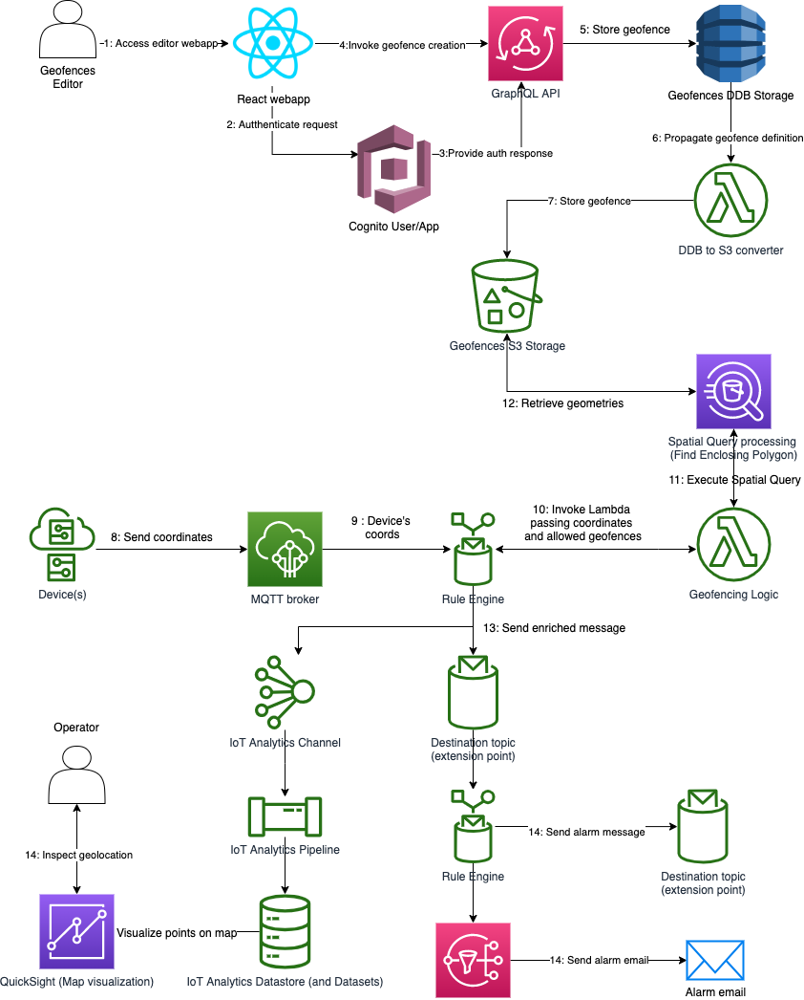

# IoT Geofencing Workshop

In this workshop, we will walk you through the creation of a geofencing solution to compare the geolocation of IoT devices that are associated with one or more allowed geofences in order to quickly detect, visualize and notify those devices that are not within the allowed geofences.

This solution is built using several AWS IoT services as well as general AWS services required for the end-to-end implementation including the visual definition of the geofences as well as the ingestion and processing of the devices' geolocation for the actual detection, visualization and notification.

The geospatial querying is performed using the Amazon Athena spatial querying capabilities.

The following diagram captures the complete architecture of the solution:

Now that you have been introduced to the solution and its architecture, lets move on the building and deployment of the solution following the steps below:

1. [Creating the geofences editor webapp](creating_webapp.md)
2. [Setting up the device and its identity](setting_device.md)
3. [Creating the IoT data ingestion path for devices and finding out the device position compared to its geofence](creating_iot_ingest.md)
4. [Visualizing the results](visualizing.md)
5. [Alarming (if required)](alarming.md)
